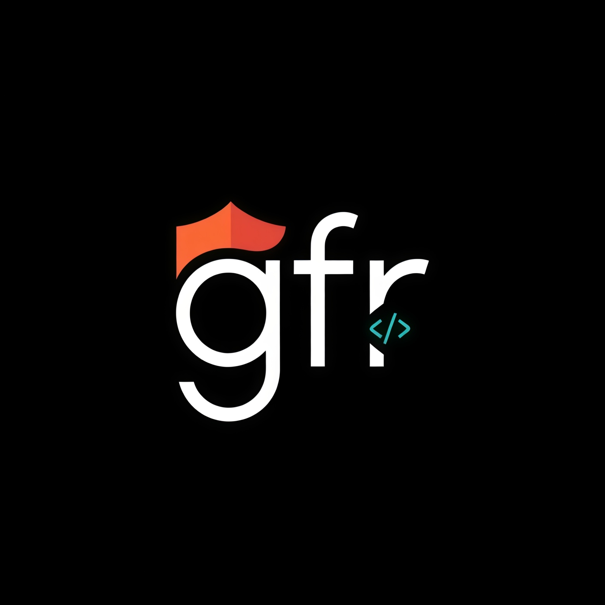

# gfr-patterns: Default Pattern Collection

<div align="center">
  
</div>

<div align="center">

[](https://opensource.org/licenses/MIT)
[](https://github.com/Kr1shna4garwal/gfr)

</div>


This repository contains the **default pattern collection** for [gfr](https://github.com/Kr1shna4garwal/gfr), a blazingly-fast Rust-based pattern search tool.

---

## Repository Structure

```
gfr-patterns/
├── README.md           # This file
├── index.json          # Pattern index file
├── patterns/           # Individual pattern files
│   ├── rce_nodejs.json
│   ├── rce_go.json
│   └── ...
└── schemas/            # JSON schemas for validation
    ├── index.schema.json
    └── pattern.schema.json
```

---

## Usage

### Installing Patterns with gfr

The easiest way to use these patterns is through the `gfr` tool:

```bash
# Install the default pattern collection
gfr install

# Install your own patterns
gfr install <YOUR index.json URL>

# List all available patterns
gfr list

# Search using a specific pattern
gfr search rce_go ./
```

### Manual Installation

You can also download and use patterns manually:

```bash
# Download a specific pattern
curl -O https://raw.githubusercontent.com/Kr1shna4garwal/gfr-patterns/main/patterns/rce_go.json

# move pattern to config directory (Below example is on MacOS)
mv rce_go.json ~/Library/Application\ Support/gfr/rce_go.json
```

---

## Pattern Structure

Each pattern is a JSON file following this structure:

```json
{
  "$schema": "https://raw.githubusercontent.com/Kr1shna4garwal/gfr-patterns/main/schemas/pattern.schema.json",
  "version": "1.0.0",
  "author": "Krishna Agarwal <kr1shna4garwal@proton.me>",
  "description": "Brief description of what this pattern finds",
  "tags": ["security", "language", "category"],
  "patterns": [
    "regex_pattern_1",
    "regex_pattern_2"
  ],
  "file_types": ["js", "ts", "go"],
  "ignore_case": true,
  "multiline": false
}
```

### Required Fields
- **`version`**: Semantic version of the pattern
- **`patterns OR pattern`**: Array of regex patterns or single pattern to search for

### Optional Fields
- **`author`**: Pattern author information
- **`description`**: What the pattern is designed to find
- **`tags`**: Categorization tags for filtering
- **`file_types`**: File extensions to limit search scope
- **`ignore_case`**: Enable case-insensitive matching (default: false)
- **`multiline`**: Allow `.` to match newlines (default: false)

---

## Contributing

I welcome contributions to expand the pattern collection! Here's how you can help:

### Adding New Patterns

1. **Fork** this repository
2. **Create a new pattern file** in the `patterns/` directory
3. **Follow the naming convention if possible**: `category_language.json` (e.g., `xss_php.json`)
4. **Update the index.json** file to include your pattern
5. **Test your pattern** with gfr locally
6. **Submit a pull request**

### Pattern Guidelines

- **Be specific**: Patterns should target specific code patterns
- **Minimize false positives**: Test your regex patterns thoroughly
- **Include context**: Add meaningful descriptions and tags
- **Follow naming conventions**: Use descriptive, lowercase names with underscores
- **Document your patterns**: Include examples of what the pattern should catch

### Example Contribution

```json
{
  "$schema": "https://raw.githubusercontent.com/Kr1shna4garwal/gfr-patterns/main/schemas/pattern.schema.json",
  "version": "1.0.0",
  "author": "Your Name or Alias",
  "description": "Finds potential SQL injection vulnerabilities in PHP",
  "tags": ["sql-injection", "php", "security", "database"],
  "patterns": [
    "\\$_(GET|POST|REQUEST|COOKIE)\\[.*\\].*\\.(query|exec|prepare)\\s*\\(",
    "mysql_query\\s*\\(.*\\$_(GET|POST|REQUEST)",
    "\\$.*\\s*=\\s*\\$_(GET|POST|REQUEST).*query\\s*\\("
  ],
  "file_types": ["php"],
  "ignore_case": true,
  "multiline": false
}
```

---

## Index File Format

The `index.json` file maintains the registry of all available patterns:

```json
{
  "$schema": "https://raw.githubusercontent.com/Kr1shna4garwal/gfr-patterns/main/schemas/index.schema.json",
  "name": "default-patterns",
  "version": "1.0.1",
  "patterns": [
    {
      "name": "pattern_name",
      "version": "1.0.0",
      "url": "https://raw.githubusercontent.com/Kr1shna4garwal/gfr-patterns/main/patterns/pattern_name.json"
    }
  ]
}
```

---

## License

This project is licensed under the **MIT License**. See the [LICENSE](LICENSE) file for details.

---

## Related Projects

- **[gfr](https://github.com/Kr1shna4garwal/gfr)** - The main gfr tool
- **[gf](https://github.com/tomnomnom/gf)** - The original inspiration for gfr

---

## Support

- **Issues**: [GitHub Issues](https://github.com/Kr1shna4garwal/gfr-patterns/issues)
- **Contact**: [kr1shna4garwal.com/contact](https://kr1shna4garwal.com/contact)

---

<div align="center">
  <sub>Powered by Caffeine and Creativity</sub>
</div>
